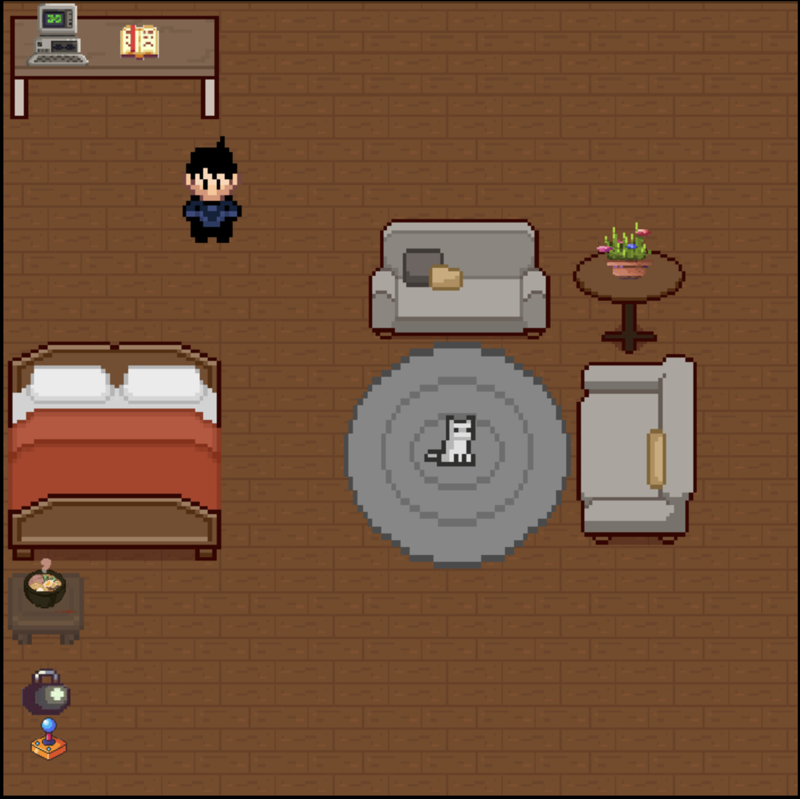

# ✅ Personal Website

Hello everyone! My name is Van and this is an HTML and Javascript implementation for my personal webpage. 

Here you will find an interative 2D pixelated environment where you can interact with various objects throughout my room! 

## ⚙️ How does it Work?

This implementation was done using purely HTML and Javascript canvas 2D rendering engine. An External Javascript library (Gifler) was used to animate gifs obtained via the unpkg content-delivery network for NPM. 

Other than the player character asset that was manually illustrated using [Piskel](https://www.piskelapp.com/). Most of the assets were obtained from various talent artists from [itch.io](https://itch.io/) and tweaked for my specific use case.

## 🎮 How to use it? 

Like in most video games, you control it via the WASD key for player movement. 

To interact with objects you make use of the E key (or if you like to occasionally see what's going on in my head you can always spam it 😭). 

Take the time to explore my room and get to know a bit more about me 😁!

## Here's an image of what my room looks like!

